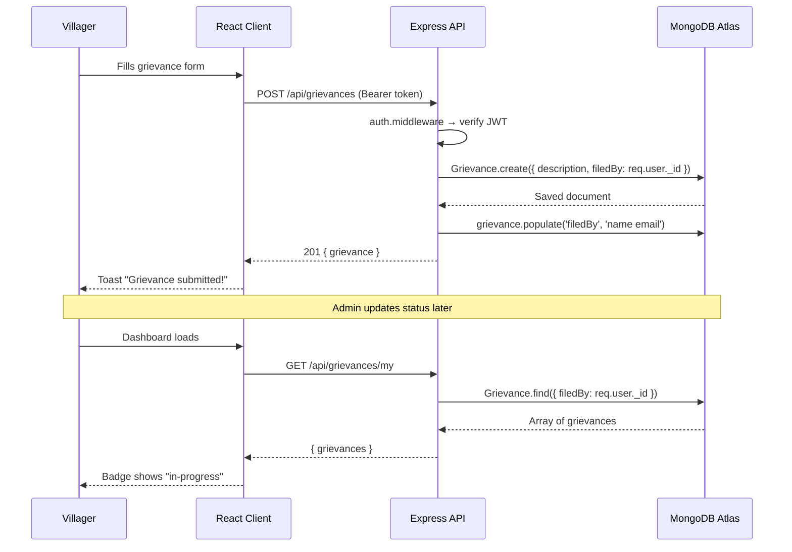

<div align="center">

# 🌿 VillageConnect

### *Bridging the gap between rural communities and the services they deserve.*

[](https://nodejs.org)
[](https://expressjs.com)
[](https://react.dev)
[](https://mongodb.com)
[](https://tailwindcss.com)
[](https://vitejs.dev)
[](https://jwt.io)
[](LICENSE)

</div>

---

## 🔭 What Is This?

**VillageConnect** is a full-stack community portal built for rural India. It puts five critical services — jobs, agriculture, healthcare, education, and grievance redressal — into a single, clean, mobile-friendly interface that any villager can use without technical expertise.

Villagers register in seconds, browse real opportunities, file complaints, and track their resolution. Administrators get a dedicated secure panel to post jobs, manage content, and oversee every grievance from submission to resolution. No paperwork. No middlemen. Just a browser.

---

## 🧩 Why This Exists

Rural communities in India are chronically underserved by fragmented, inaccessible information systems. A farmer looking for a government agricultural scheme, a student searching for a scholarship, or a resident trying to file a local complaint — each has to navigate a maze of disconnected portals, if they can access them at all.

VillageConnect collapses all of this into one authenticated, role-aware application. The admin posts; the villager reads, applies, and raises concerns — with live status tracking every step of the way.

---

## ✨ Feature Highlights

### 👩‍🌾 For Villagers
- 📋 **Jobs Board** — Browse job listings with real-time title & location search, powered by MongoDB regex queries
- 🌾 **Agriculture Hub** — Farming tips and government schemes categorised by type (`tip` | `scheme`)
- 🏥 **Healthcare Directory** — Local health services and wellness information with freshness timestamps
- 📚 **Education Resources** — Courses, scholarships, and resource links in one place
- 📣 **Grievance System** — Submit complaints, track status (`pending` → `in-progress` → `resolved`), see live badge updates on the dashboard
- 👤 **Profile Management** — Update display name; session persisted across page refreshes

### 🛡️ For Admins
- 🔐 **Dedicated Admin Login** — Separate entry point (`/admin-login`) with server-side role verification; non-admins are rejected even with valid credentials
- 📊 **Admin Dashboard** — Real-time stat cards for total users, grievances, pending items, and jobs — loaded in a single parallel Promise.all call
- ⚙️ **Module Manager** — Full CRUD for Jobs, Agriculture Tips, Healthcare Info, and Education Resources
- 👥 **User Directory** — Browse all registered villagers with join dates and roles
- 🗂️ **Grievance Management** — View all complaints with filer info, update status with validation

### 🏗️ Platform-Level
- 🔒 **JWT Auth** — Bearer token attached to every API request via Axios interceptor; auto-logout on 401
- 🔄 **Session Restore** — On page load, the app silently validates the stored token against `/api/auth/me` and restores state without forcing re-login
- 🎨 **Skeleton Loading** — Shimmer placeholders on every data-fetching screen; no jarring layout shifts
- 🍞 **Toast Notifications** — Animated slide-in/out toasts for every success and error state
- 📱 **Fully Responsive** — Mobile hamburger nav, drawer sidebars, and adaptive grid layouts throughout

---

## 🛠️ Tech Stack

| Layer | Technology |
|-------|-----------|
| **Frontend Framework** | React 18 + Vite 8 |
| **Styling** | Tailwind CSS 4 (via `@import "tailwindcss"`) with custom `@theme` design tokens |
| **Typography** | Inter (Google Fonts) |
| **Routing** | React Router DOM v7 |
| **HTTP Client** | Axios with request/response interceptors |
| **Backend Framework** | Express 5 |
| **Database** | MongoDB Atlas via Mongoose 9 |
| **Authentication** | JWT (`jsonwebtoken`) + `bcryptjs` password hashing |
| **Security** | Helmet, CORS, role-based middleware (`adminOnly`) |
| **Logging** | Morgan (dev mode) |
| **Dev Server** | Nodemon (server) + Vite HMR (client) |
| **Environment** | dotenv / dotenvx |

---

## 🗂️ Project Structure

```
VillageConnect/
│
├── client/                         # React + Vite frontend
│   └── src/
│       ├── api/                    # Axios API layer (one file per resource)
│       │   ├── axiosInstance.js    # Base URL, auth header, 401 interceptor
│       │   ├── auth.api.js
│       │   ├── job.api.js
│       │   ├── grievance.api.js
│       │   ├── agriculture.api.js
│       │   ├── healthcare.api.js
│       │   ├── education.api.js
│       │   └── user.api.js
│       │
│       ├── components/
│       │   ├── cards/              # JobCard, GrievanceCard, ServiceCard
│       │   ├── layout/             # Navbar, Footer, VillagerLayout, AdminLayout, AdminSidebar, AdminTopbar
│       │   └── ui/                 # Button, Input, Badge, Modal, Spinner, SkeletonCard, ToastContainer
│       │
│       ├── context/
│       │   ├── AuthContext.jsx     # Global auth state + session restore on mount
│       │   └── ToastContext.jsx    # Global toast notification system
│       │
│       ├── pages/
│       │   ├── HomePage.jsx        # Public landing page with hero, services, how-it-works
│       │   ├── auth/
│       │   │   ├── LoginPage.jsx       # Villager login
│       │   │   ├── AdminLoginPage.jsx  # Admin-only login with role gate
│       │   │   └── RegisterPage.jsx    # Villager registration (role locked to 'villager')
│       │   ├── villager/           # Dashboard, Jobs, JobDetail, Agriculture, Healthcare, Education, Grievance, Profile
│       │   └── admin/              # AdminDashboard, UsersPage, GrievanceManagement, ModuleManagerPage
│       │
│       ├── routes/
│       │   ├── AppRouter.jsx       # All routes including PublicOnlyRoute guard
│       │   ├── ProtectedRoute.jsx  # Redirects unauthenticated users to /login
│       │   └── RoleRoute.jsx       # Redirects non-admins away from /admin/*
│       │
│       ├── utils/
│       │   ├── formatDate.js       # formatDate() and formatDateShort() helpers
│       │   └── tokenStorage.js     # localStorage get/set/remove for JWT
│       │
│       ├── index.css               # Global styles, design tokens, skeleton & toast animations
│       └── main.jsx                # App entry — AuthProvider wraps everything
│
└── server/                         # Express 5 + Mongoose backend
    ├── config/
    │   └── db.js                   # MongoDB Atlas connection
    ├── controllers/                # auth, job, grievance, agriculture, healthcare, education, user
    ├── middleware/
    │   ├── auth.middleware.js      # JWT verify → req.user
    │   └── role.middleware.js      # adminOnly gate (403 for non-admins)
    ├── models/                     # Mongoose schemas: User, Job, Grievance, AgricultureTip, HealthInfo, EducationResource
    ├── routes/                     # Express routers (one per resource)
    ├── server.js                   # App bootstrap: CORS, Helmet, Morgan, routes, error handler
    ├── seedAdmin.js                # One-time script to create the admin account
    └── .env.example                # Environment variable template
```

---

## 🚀 Getting Started

### Prerequisites

- **Node.js** ≥ 18
- **npm** ≥ 9
- A **MongoDB Atlas** cluster URI (free tier works fine)

---

### 1. Clone the repository

```bash
git clone https://github.com/your-username/VillageConnect.git
cd VillageConnect
```

### 2. Configure the server

```bash
cd server
cp .env.example .env
```

Edit `.env`:

```env
PORT=5000
MONGO_URI=mongodb+srv://<user>:<password>@cluster0.xxxxx.mongodb.net/?appName=Cluster0
JWT_SECRET=your_super_secret_key_here
JWT_EXPIRES_IN=7d
NODE_ENV=development
CLIENT_URL=http://localhost:5173
```

### 3. Install dependencies

```bash
# Server
cd server && npm install

# Client
cd ../client && npm install
```

### 4. Seed the admin account

> Run this **once** to create your admin user in MongoDB. Edit `ADMIN_EMAIL` and `ADMIN_PASSWORD` inside the file first.

```bash
cd server
node seedAdmin.js
```

Output on success:
```
✅ MongoDB connected
✅ Admin account created successfully!
   Email   : admin@villageconnect.com
   Password: Admin@1234
🔌 Disconnected from MongoDB
```

### 5. Start both servers

```bash
# Terminal 1 — API server (http://localhost:5000)
cd server && npm run dev

# Terminal 2 — React client (http://localhost:5173)
cd client && npm run dev
```

Open **http://localhost:5173** in your browser.

---

## 💡 Usage Examples

### Register as a Villager
Navigate to `/register` or click **"Get Started — It's Free"** on the home page. All accounts created through the UI are automatically assigned the `villager` role.

### Admin Login
On the home page, click **"Admin Login →"** (below the hero buttons) or go to `/admin-login` directly.

```
Email:    admin@villageconnect.com
Password: Admin@1234
```

### Search Jobs (API)
```http
GET /api/jobs?search=farmer&location=andhra
Authorization: Bearer <token>
```

### Submit a Grievance (API)
```http
POST /api/grievances
Authorization: Bearer <token>
Content-Type: application/json

{
  "description": "Road near village market is not repaired for 3 months."
}
```

### Update Grievance Status (Admin only)
```http
PUT /api/grievances/:id/status
Authorization: Bearer <admin-token>
Content-Type: application/json

{
  "status": "in-progress"
}
```

Valid values: `pending` | `in-progress` | `resolved`

---

## ⚙️ Configuration

### Server — `.env`

| Variable | Required | Description |
|----------|----------|-------------|
| `PORT` | No | Port to run the API server (default: `5000`) |
| `MONGO_URI` | **Yes** | Full MongoDB Atlas connection string |
| `JWT_SECRET` | **Yes** | Secret key used to sign JWT tokens |
| `JWT_EXPIRES_IN` | No | Token expiry duration (default: `7d`) |
| `NODE_ENV` | No | `development` or `production` |
| `CLIENT_URL` | No | Allowed CORS origin (default: `http://localhost:5173`) |

### Client — Environment

Create `client/.env` to override the API base URL:

```env
VITE_API_URL=http://localhost:5000
```

If omitted, the client defaults to `http://localhost:5000`.

---

## 🔬 How It Works

### Authentication Flow

```
Browser                   Client (React)               Server (Express)
  │                           │                               │
  │── POST /api/auth/login ──►│── axios → POST /api/login ──►│
  │                           │                               │── bcrypt.compare()
  │                           │                               │── jwt.sign()
  │                           │◄── { token, user } ──────────│
  │                           │── localStorage.setItem() ─── │
  │                           │── AuthContext.login() ─────── │
  │── redirect /dashboard ───►│                               │
```

Every subsequent request goes through `axiosInstance`, which reads the token from `localStorage` and injects `Authorization: Bearer <token>` automatically. On any `401` response, the interceptor clears the token and redirects to `/login`.

### Role-Based Access Control (RBAC)

Two middleware layers protect the server:

1. **`auth.middleware.js`** — Verifies the JWT and attaches `req.user` to every protected route.
2. **`role.middleware.js`** — Checks `req.user.role === 'admin'`; returns `403` for everyone else.

On the client, two route guards mirror this:

- **`ProtectedRoute`** — Redirects unauthenticated users to `/login`.
- **`RoleRoute`** — Redirects non-admin users away from `/admin/*`.

The **Admin Login page** (`/admin-login`) adds a third layer: even if credentials are correct, if the user's `role` is not `admin`, the response is rejected client-side with an "Access denied" message before any auth state is stored.

### Data Flow (Grievance Example)



### Session Persistence

On every page load, `AuthContext` reads the JWT from `localStorage` and silently calls `GET /api/auth/me`. If valid, the user is restored to state without any visible loading screen. If the token is expired or tampered, it is cleared and the user is sent to the login page.

---

## 🤝 Contributing

Contributions are welcome! Here's how to get involved:

1. **Fork** the repository
2. **Create** a feature branch: `git checkout -b feature/your-feature-name`
3. **Commit** your changes: `git commit -m "feat: add your feature"`
4. **Push** to your fork: `git push origin feature/your-feature-name`
5. **Open a Pull Request** — describe what you built and why

### Guidelines

- Keep PRs focused and small — one feature or fix per PR
- Follow the existing code style (ES modules, async/await, no callbacks)
- Do not commit `.env` files or secrets
- Test your changes against a local MongoDB instance before submitting

---

## 📄 License

This project is licensed under the **ISC License**.

---

<div align="center">

**Built with 🌿 for the villages that power the nation.**

*Every feature in this app exists because someone, somewhere, needed it.*

</div>
